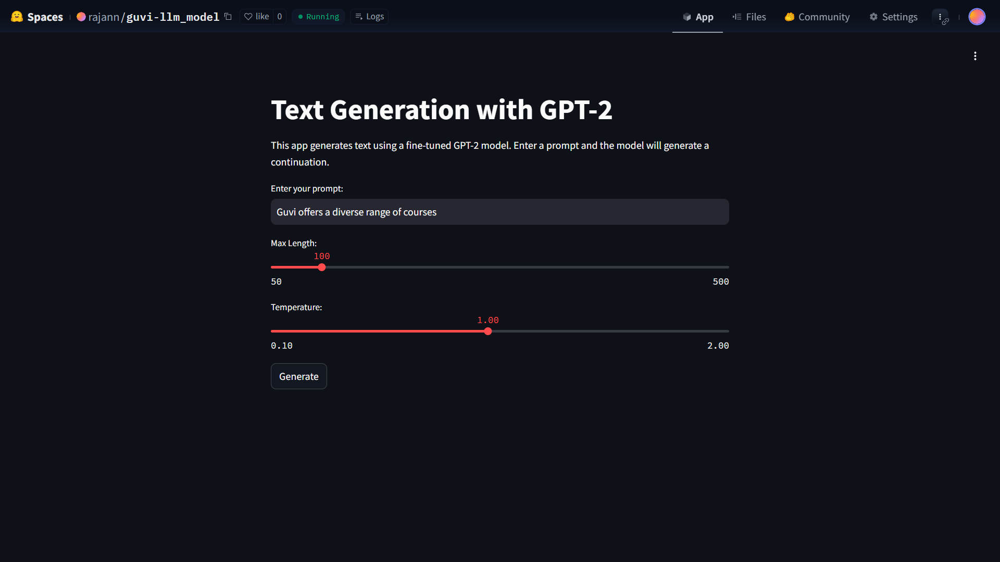
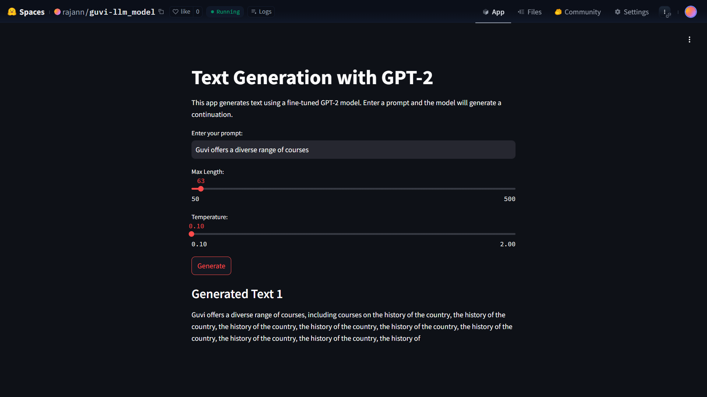
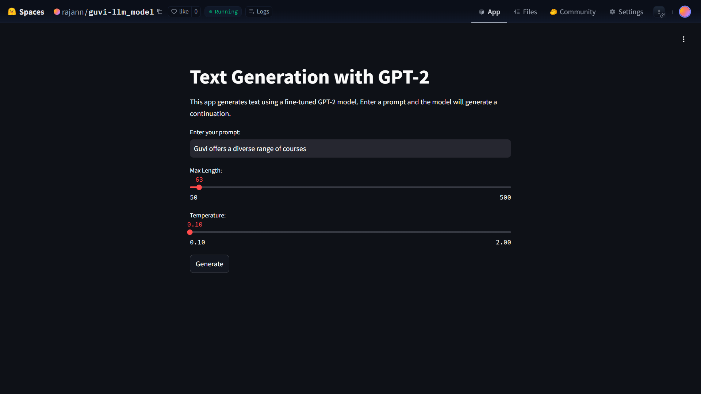

# 💻 GUVI LLM Project – GPT-2 Fine-Tuning & Deployment

This project focuses on fine-tuning a GPT-2 based language model using domain-specific data related to GUVI and deploying it as a real-time web application using Hugging Face Spaces.

## 🚀 Live Demo

👉 https://huggingface.co/spaces/rajann/guvi-llm_model  

---
The system generates contextually relevant and coherent text responses based on user input.

---

## 🧩 Problem Statement

Deploy a fine-tuned GPT model trained on GUVI-related data as a scalable web application.  
The application should allow users to interact with the model in real time and be hosted using Hugging Face Spaces.

---
## 📸 Demo

### 🏠 Home

---

### 💬 Prompt Input

---

### 🤖 Generated Response

---

### 🌡️ Temperature Adjustment

---
## 🎯 Objective

- Fine-tune a GPT-2 model using custom dataset  
- Build an interactive web interface using Streamlit  
- Deploy the model using Hugging Face Spaces  
- Enable real-time text generation for users  

---

## 🏗️ System Architecture

User Input → Streamlit UI → GPT-2 Model → Generated Output

---

## 📊 Dataset

Data was collected from multiple sources:
- GUVI website
- LinkedIn
- Wikipedia
- GitHub
- Social media platforms

The dataset was curated and cleaned before training.

---

## ⚙️ Methodology

1. **Data Collection**  
   Collected domain-specific textual data  

2. **Data Preprocessing**  
   Cleaned and structured text for training  

3. **Tokenization**  
   Used GPT-2 tokenizer  

4. **Model Fine-Tuning**  
   Fine-tuned GPT-2 using HuggingFace Transformers  

5. **Deployment**  
   Hosted the model on Hugging Face Spaces with Streamlit  

---

## 🤖 Model Details

- Base Model: GPT-2  
- Framework: HuggingFace Transformers  
- Training Platform: Google Colab  
- Token Size: ~10,000 tokens  

---

## 🛠️ Tech Stack

- Python  
- PyTorch  
- HuggingFace Transformers  
- Streamlit  
- HuggingFace Spaces  

---

## 📈 Results

- Improved text coherence and contextual relevance  
- Reduced repetitive output through fine-tuning  
- Enabled real-time inference via deployed application  

---

## 📌 Key Features

- End-to-end LLM pipeline (data → training → deployment)  
- Real-time text generation  
- Lightweight and accessible web interface  
- Cloud deployment using Hugging Face Spaces  

---

## 🔮 Future Improvements

- Add evaluation metrics (Perplexity / BLEU score)  
- Improve dataset quality and size  
- Add FastAPI backend for production use  
- Implement user session tracking and logging  

---

## ⚠️ Notes

- Training requires high RAM (recommended: Google Colab or high-performance system)  
- Model performance depends on dataset quality  

---
